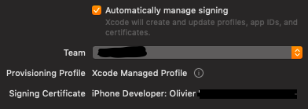
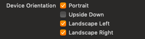

# Qt iOS CMake

## What it is

This project provide a CMake macro to help you deploy Qt Application for iOS. This macro replace all kind of stuff QMake is doing under the hood and add lots of options to customize `Info.plist`.

* Correctly link to all qt libraries. *Optimization can be done here.*
* Link with required framework. *Optimization can be done here.*
* Redirect entry point to create UIApplication before regular `main()`.
* Generate `Info.plist` with inputs
* Sign the **XCode** Generated project

The main goal is to build the app without any change inside XCode.

This utility has been developed for my own needs. Don't hesitate to use / share / fork / modify / improve it freely :)

*This project is conceptually based on the great [QtAndroidCMake of Laurent Gomila](https://github.com/LaurentGomila/qt-android-cmake).*

### Showcase

The Application [QaterialGallery](https://github.com/OlivierLDff/QaterialGallery) showcase the use of this library. *See QtIosCMake call in `platforms/Deploy.cmake` and iOs ressources in `platforms/ios/`. See QtStaticCMake call in `platforms/Deploy.cmake`*

## How to use it

### How to integrate it to your CMake configuration

All you have to do is to call the ```add_qt_ios_app``` macro. No additionnal target will be generated, only the main target property are going to change. Of course this is not enough and you'll need to add extract arguments.

```cmake
IF(${CMAKE_SYSTEM_NAME} STREQUAL "iOS")
    INCLUDE(QtIosCMake/AddQtIosApp.cmake)
    add_qt_ios_app(MyApp)
ENDIF()
```

### How to run CMake

**Prerequisite:**

* Be on recent version of [macOs](https://www.apple.com/fr/macos/mojave/).
* Latest Version of [XCode](https://developer.apple.com/xcode/).
* [Qt](https://www.qt.io/) compiled for iOs as static library.
* [iOs CMake Toolchain](https://github.com/OlivierLDff/IosCMakeToolchain).
* Generate Qt Import Plugin statement. See [these macros](https://github.com/OlivierLDff/QtStaticCMake).
* An [Apple Developer Licence](https://developer.apple.com/) if you want to deploy on real device.

If you installed official Qt binary, Qt Sdk binary is located in:

```bash
export QT_USER_ID=$(id -un)
export QT_IOS_VERSION=5.12.0
export QT_IOS_DIR=/Users/$QT_USER_ID/Qt/$QT_IOS_VERSION/ios
```

Then simply run CMake with [this toolchain](https://github.com/OlivierLDff/IosCMakeToolchain). Read the toolchain README for more information.

```bash
cmake -DCMAKE_PREFIX_PATH=$QT_IOS_DIR \
-DDEPLOYMENT_TARGET=11.0 \
-DCMAKE_TOOLCHAIN_FILE=/path/to/ios.toolchain.cmake \
-DPLATFORM=OS64COMBINED \
-DENABLE_BITCODE=FALSE \
-G "XCode" \
path/to/Projet/
```

Then you can simply build your app:

```bash
cmake --build . --config Release
```

**Notes**

*  **OS64COMBINED** is only available if you are using CMake 3.14+.
* Generator **XCode** is required to sign app and create a bundle app.
* **Qt 5.12**:
  * If you use prebuild qt ios library, then bitcode is disabled.
  * Library is build with minimum Os support 11.0. You need to do the same.
*  You can also specify `QT_IOS_CODE_SIGN_IDENTITY` and `QT_IOS_TEAM_ID` when running CMake because these variables are rarely inside the `CMakeLists.txt`.
* **Qt < 5.15**: You may need to add ios library by yourself. With newer version of Qt, the required flags are added in Qt's CMake scripts.

``` cmake
target_link_libraries(MyApp PUBLIC "-framework Foundation -framework AVFoundation -framework SystemConfiguration -framework AssetsLibrary -framework OpenGLES \
    -framework CoreText -framework QuartzCore -framework CoreGraphics -framework ImageIO -framework Security -framework UIKit -framework WebKit \
    -framework CoreBluetooth -framework MobileCoreServices -framework QuickLook -framework AudioToolbox -framework CoreLocation \
    -framework Accelerate -framework CoreMedia -framework CoreVideo -framework MediaToolbox -framework MediaPlayer -framework GameController
    -framework CoreMotion -framework StoreKit -weak_framework Metal -lz")
```

## Options of the ```add_qt_ios_app``` macro

The first argument is the executable target that will become an app.

The macro also accepts optional named arguments. Any combination of these arguments is valid. Example:

```cmake
add_qt_ios_app(MyApp
    NAME "My App"
    BUNDLE_IDENTIFIER "com.company.app"
    VERSION "1.2.3"
    SHORT_VERSION "1.2.3"
    LONG_VERSION "1.2.3.456"
    CUSTOM_PLIST "path/to/MacOSXBundleInfo.plist.in"
    CODE_SIGN_IDENTITY "iPhone Developer"
    TEAM_ID "AAAAAAAA"
    COPYRIGHT "My Cool Copyright"
    QML_DIR "${QT_IOS_QT_ROOT}/qml"
    ASSET_DIR "path/to/Assets.xcassets"
    MAIN_STORYBOARD "/path/to/Main.storyboard"
    LAUNCHSCREEN_STORYBOARD "path/to/LaunchScreen.storyboard"
    CATALOG_APPICON "AppIcon"
    CATALOG_LAUNCHIMAGE "LaunchImage"
    ORIENTATION_PORTRAIT
    ORIENTATION_PORTRAIT_UPSIDEDOWN
    ORIENTATION_LANDSCAPELEFT
    ORIENTATION_LANDSCAPERIGHT
    SUPPORT_IPHONE
    SUPPORT_IPAD
    REQUIRES_FULL_SCREEN
    HIDDEN_STATUS_BAR
    VERBOSE
 )
```

Here is the full list of possible arguments:

**NAME**

The bundle display name is the name displayed underneath the application icon. This value should be localized for all supported languages. If not given, the name of the source target is taken. The default is `${TARGET}`. This is the name displayed on the os. This is the equivalent of the **Display Name** field under *General* XCode.

*Example:*

```cmake
add_qt_ios_app(MyApp
    NAME "My App"
)
```


**BUNDLE_IDENTIFIER**

The application bundle identifier. A bundle identifier lets iOS and macOS recognize any updates to your app. Your bundle ID must be registered with Apple and be unique to your app. Bundle IDs are app-type specific (either iOS or macOS). The same bundle ID cannot be used for both iOS and macOS apps.

Bundle identifiers are usually (not always) written out in reverse DNS notation (`com.myCompany.myApp`).

If not specified, the default value is `${CMAKE_PROJECT_NAME}.${TARGET}`.

*Example:*

```cmake
add_qt_ios_app(MyApp
    BUNDLE_IDENTIFIER "com.myCompany.myApp"
)
```


**VERSION**

The string that specifies the build version number of the bundle. This value is a monotonically increased string, comprised of one or more period-separated integers. This value can correspond to either released or unreleased versions of the application. This value cannot be localized. The default is `${CMAKE_PROJECT_VERSION}` is set, otherwise  `1.0.0`.

*Example:*

```cmake
add_qt_ios_app(MyApp
    VERSION "1.2.3"
)
```


**SHORT_VERSION**

The release version of the application. The value of this key is a string comprised of three period-separated integers. This is default to **VERSION**.

*Example:*

```cmake
add_qt_ios_app(MyApp
    SHORT_VERSION "1.2.3"
)
```

**LONG_VERSION**

The release version of the application that usualy include the build number. This is default to **VERSION**.

*Example:*

```cmake
add_qt_ios_app(MyApp
    LONG_VERSION "1.2.3"
)
```

**CUSTOM_PLIST**

It is possible to specify a custom pList file. The default is `MacOSXBundleInfo.plist.in`. CMake include a basic template [here](https://github.com/Kitware/CMake/blob/master/Modules/MacOSXBundleInfo.plist.in). Qt also add some recommendation, read more about it [here](https://doc.qt.io/qt-5/ios-platform-notes.html). The file in this repository is a variant of the CMake ones that have more configurable field from CMake. If you use your own `plist.in` some feature of this macro won't work anymore. Don't forget to copy in your file:

**Orientation**

```xml
<!-- Ui Orientation -->
<key>UISupportedInterfaceOrientations</key>
<array>
    <string>${MACOSX_BUNDLE_PORTRAIT}</string>
    <string>${MACOSX_BUNDLE_LANDSCAPELEFT}</string>
    <string>${MACOSX_BUNDLE_LANDSCAPERIGHT}</string>
</array>
<key>UISupportedInterfaceOrientations~ipad</key>
<array>
    <string>${MACOSX_BUNDLE_PORTRAIT}</string>
    <string>${MACOSX_BUNDLE_PORTRAITUPDOWN}</string>
    <string>${MACOSX_BUNDLE_LANDSCAPELEFT}</string>
    <string>${MACOSX_BUNDLE_LANDSCAPERIGHT}</string>
</array>
```
**RequireFullScreen**

```xml
<!-- Full screen, allow multi task or not  -->
<key>UIRequiresFullScreen</key>
<string>${MACOSX_BUNDLE_REQUIRES_FULL_SCREEN}</string>
```
**StatusBarHidden**

```xml
<!-- Hide the status bar -->
<key>UIStatusBarHidden</key>
<${MACOSX_BUNDLE_HIDDEN_STATUS_BAR}/>
```
**LaunchStoryboard**

```xml
<!-- If supporting multitask LaunchScreen.storyboard must be provided -->
<key>UILaunchStoryboardName</key>
<string>${MACOSX_BUNDLE_LAUNCHSCREEN_STORYBOARD}</string>
```
**MainStoryboard**

```xml
<!-- Optionnal StoryBoard filename -->
<key>UIMainStoryboardFile</key>
<string>${MACOSX_BUNDLE_MAIN_STORYBOARD}</string>
```
*Example:*

```cmake
add_qt_ios_app(MyApp
    CUSTOM_PLIST "path/to/Info.plist.in"
)
```

The pList file can also be a file that isn't gonna be configured it's gonna work the same way.

**CODE_SIGN_IDENTITY**

Code signing is required in order to deploy to real ios device (ie non simulator). More info [here](https://developer.apple.com/support/code-signing/). *By default "iPhone Developer".* Possible values are:

```bash
"iPhone Developer"
"iPhone Distribution"
```

*Example:*

```cmake
add_qt_ios_app(MyApp
    CODE_SIGN_IDENTITY "iPhone Developer"
)
```

**TEAM_ID**

The team id used to sign the application. *By default "AAAAAAAA."*

You can see possible values by executing:

```bash
/usr/bin/env xcrun security find-identity -v -p codesigning
```

*Example:*

```cmake
add_qt_ios_app(MyApp
    TEAM_ID "AAAAAAAA"
)
```



**COPYRIGHT**

Set the copyright in the info.plist. *Optional*

*Example:*

```cmake
add_qt_ios_app(MyApp
    COPYRIGHT "Cool Copyright 2019"
)
```

**QML_DIR**

Used to link with qml libs. By default it is set to qt sdk qml dir but you can specify your own.

*Example:*

```cmake
add_qt_ios_app(MyApp
    QML_DIR "path/to/qml"
)
```

**ASSET_DIR**

You can specify with this variable one or multiples asset dir to be package with the app.

**CATALOG_APPICON**

Specify the AppIcon folder inside your Assets folder. *By Default "AppIcon".*


**CATALOG_LAUNCHIMAGE**

Specify the AppIcon folder inside your Assets folder. *By Default "LaunchImage".*


**LAUNCHSCREEN_STORYBOARD**

Specify the file to use as LaunchScreen Storyboard. This file will be bundle into the App. This is mandatory to support Split Screen if `REQUIRES_FULL_SCREEN` isn't set.


**MAIN_STORYBOARD**

*This file seems to be optionnal is you use only Qt/Qml.*

Set the Main Storyboard of your app. The file will also be bundled.


**ORIENTATION**

The default allowed orientation can be set with flags:

* `ORIENTATION_PORTRAIT`: Set *UIInterfaceOrientationPortrait* flag.
* `ORIENTATION_PORTRAIT_UPSIDEDOWN`: Set *UIInterfaceOrientationPortraitUpSideDown* flag.
* `ORIENTATION_LANDSCAPELEFT`: Set *UIInterfaceOrientationLandscapeLeft* flag.
* `ORIENTATION_LANDSCAPERIGHT`: Set *UIInterfaceOrientationLandscapeRight* flag.



**SUPPORTED DEVICES**

You can specify supported device either iPhone or iPad or both by settings:

* `SUPPORT_IPHONE`: Support iPhone.


* `SUPPORT_IPAD`: Support iPad.


When the two flags are specified deployment will result in Universal. This is also the default behavior.


**REQUIRES_FULL_SCREEN**

This flag disable the multitask feature. By doing so `LaunchScreen.storyboard` become optionnal.


**HIDDEN_STATUS_BAR**

Set `UIStatusBarHidden`to true.


**VERBOSE**

Print all debug information. Usefull to check if configuration is ok.

## Notes

* On iPhone X+ the app doesn't show in full screen, you need to add `flags: Qt.MaximizeUsingFullscreenGeometryHint` to your main Qml window.
* On iOs Qt is statically linked which mean you need to import by hand required plugins. Or you can use the macro in [QtStaticCMake](https://github.com/OlivierLDff/QtStaticCMake).
  * Generate Qt Plugin import source file.
  * Generate Qt Qml Plugin import source file.
  * Add Correct linker to load platform library `qios`.

*Tested with XCode 10.2.1, Qt5.12.0, iOs 12.2.*

## Improvement Idea

- [ ] Option to specify additional framework.
- [ ] Add iOs capabilities. *Wifi, Background Mode, Hotspot Configuration, Multipath, NFC, Notification, ...*
- [ ] Never tried to add ObjC.
- [ ] Access to Native Image Picker.

## Related Link

* [Qt For Ios](https://doc.qt.io/qt-5/ios.html)
* [Qt Platform Notes](https://doc.qt.io/qt-5/ios-platform-notes.html)
* [QtStaticCMake](https://github.com/OlivierLDff/QtStaticCMake)
* [Ios CMake Toolchain from leethal](https://github.com/OlivierLDff/IosCMakeToolchain)
* [Ios helloworld project](https://github.com/siavashk/qt5-static-hello-world)
* [XCode flag example](https://github.com/wrld3d/wrld-example-app/blob/master/ios/CMakeLists.txt)
* [Apple Bundle Docs](https://developer.apple.com/library/archive/documentation/CoreFoundation/Conceptual/CFBundles/BundleTypes/BundleTypes.html#//apple_ref/doc/uid/10000123i-CH101-SW1)
* [Deploy on App Store](https://developer.apple.com/support/app-store-connect/)
* [App Distribution Guide](https://help.apple.com/xcode/mac/current/#/dev067853c94)

## Contact

* Olivier Le Doeuff: olivier.ldff@gmail.com
